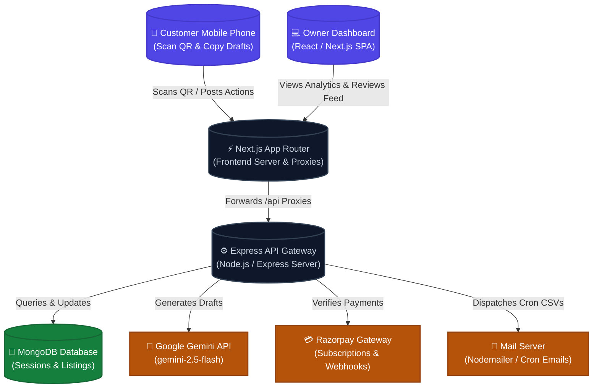

# 🌟 ReviewGenerator: AI-Powered Local Business GMB Review Booster

[](https://nextjs.org/)
[](https://nodejs.org/)
[](https://www.mongodb.com/)
[](https://deepmind.google/technologies/gemini/)
[](https://razorpay.com/)

> A premium SaaS platform enabling local businesses to skyrocket their Google Business Profile (GMB) reviews using dynamic QR codes, multilingual Generative AI review drafts, real-time conversion funnel tracking, and automated daily email analytics.

---

## 📖 Table of Contents
1. [Core Features](#-core-features)
2. [SaaS Architecture](#-saas-architecture)
3. [Technology Stack](#-technology-stack)
4. [Project Structure](#-project-structure)
5. [Environment Configuration](#-environment-configuration)
6. [Local Installation & Setup](#-local-installation--setup)
7. [API Documentation](#-api-documentation)
8. [Data Privacy & Compliance (DPDP Act)](#-data-privacy--compliance-dpdp-act)
9. [License](#-license)

---

## ⚡ Core Features

### 🤳 Multilingual AI Review Flow (Customer Side)
* **One-Scan Access**: Customers scan a dynamic tabletop QR code that redirects to a lightweight, zero-install mobile web application.
* **Smart Star Ratings & Language Select**: Customers tap a rating (1-5★) and choose their preferred language:
  * **English**
  * **Hindi (Standard Devnagari)**
  * **Hinglish (Colloquial Hindi written in Latin/English characters)**
* **4-Option Draft Generator**: Generates 4 custom-tailored AI drafts based on the selected stars, business category, location, and specific services/menu tags using Google's **Gemini 2.5 Flash** model.
* **1-Click Copy & Redirect**: Customers copy their chosen draft and are instantly redirected to the GMB review form with a pre-filled rating, allowing a seamless paste operation in under 10 seconds.

### 🎨 QR Studio & Printable Review Cards (Owner Side)
* **Interactive Poster Studio**: Business owners can customize, preview, and generate print-ready review display cards instead of raw black-and-white QR squares.
* **Multiple Designer Layouts & HSL Themes**: Switch between 4 artistic layouts (`Editorial`, `Split`, `Minimal`, `Phone Poster`) and 5 cohesive color palettes (`Editorial`, `Modern`, `Gallery`, `Mist`, `Olive`).
* **High-Resolution Exports**: Download customized vectors as high-definition PNG/JPEG files or directly compile print-ready PDFs.
* **Zero-Dependency PDF Compiler**: Integrates a lightweight binary PDF stream builder (`buildPdfFromJpegBytes`) directly on the client to completely avoid heavy third-party canvas or layout libraries, keeping client bundles exceptionally small and fast.
* **Dynamic QR Redirection**: QR codes point to a persistent nanoid-slug endpoint. Owners can modify listing parameters (categories, speciality keywords, GMB links) anytime in Settings without reprinting physical signs.

### 📊 Real-Time Owner Analytics & Dashboard (Owner Side)
* **Expert UI Sidebar Layout**: Responsive desktop sidebar and slide-out mobile drawer with dynamic, blur-gradient background orbs and glassmorphic visual widgets.
* **Funnels & Conversions**: Tracks review sessions from initial QR scan &rarr; AI draft generation &rarr; Clipboard copy &rarr; WhatsApp sharing.
* **Local Pack ROI Metrics**: Estimates search visibility boost (Google Local Pack rankings) and hours saved.
* **Visual Charts**: Interactive SVG time-series charts showcasing daily scan and generation metrics.
* **Razorpay Billing Integrations**: Fully functional trial logic (up to 25 drafts) transitioning to a ₹799/month unlimited Starter Subscription plan with integrated mock/real Razorpay webhook payment processing.

### 📧 Automated Reviews Feed & Daily Cron Summaries
* **Reviews Feed**: Historical feed displaying all scans. Owners can search drafts, filter by star ratings, languages, and conversion status, and expand cards to see all 4 options generated (highlighting the exact draft copied by the customer).
* **Daily Performance Emails**: Daily cron job automatically compiles scan metrics, positive/negative sentiment breakdown, and appends a detailed CSV spreadsheet containing all review metadata from that day. Emails are suppressed if zero traffic occurred, preventing inbox noise.

### 🛡️ Type Safety, Validation & Abuse Prevention (Security First)
* **End-to-End Type Safety**: Integrated strict schema-based validations using `Zod` on both client (form inputs) and API gateway boundaries (signup/login credentials, consent rules, business listings, review tracking, billing events).
* **Multi-Tier Rate Limiting**: Deployed IP rate limits using `rate-limiter-flexible` across frontend Next.js App Router and backend Express routes (General API, Auth Attempts, AI Generation, Payments, Cron runs).
* **Secure Webhooks & Job Auth**: Mandates signature verification (`x-razorpay-signature`) via SHA-256 HMAC for Razorpay webhooks, and header-based authorization (`Bearer {CRON_SECRET}`) for administrative cron entries.
* **Strict DB Constraints**: Mongoose schema enhancements enforcing exact length limits, enum bounds, unicode business tag constraints (max 8 tags, 1-30 chars, no special characters), and nanoid slug patterns.

---

## 🏗️ SaaS Architecture



---

## 🛠️ Technology Stack

### Frontend Client
* **Framework**: Next.js 15 (App Router, Turbopack)
* **State Management**: React Context / Hooks
* **Authentication**: NextAuth.js (Credentials Provider, Email Provider for magic links)
* **Styling**: Tailwind CSS & Vanilla CSS (Harmonious Slate-950 and Indigo accents)
* **Aesthetic Components**: Lucide React Icons & Custom dynamic CSS gradient orbs
* **QR Design**: `qr-code-styling` for custom dot and corner vectors
* **Utilities**: `zod` validation, `rate-limiter-flexible` client memory throttle

### Backend Server
* **Environment**: Node.js, TypeScript, ts-node-dev
* **API Gateway**: Express.js
* **Database Access**: Mongoose ODM (MongoDB)
* **AI Orchestration**: Google Gen AI SDK (`@google/generative-ai`)
* **Background Jobs**: Node-Cron (Daily Performance Reports)
* **Email dispatch**: Nodemailer (SMTP transport & CSV attachments)
* **Security & Validation**: `zod` endpoint verification, `rate-limiter-flexible` Express middleware, `crypto` for SHA-256 webhook HMAC signatures

---

## 📁 Project Structure

```text
ReviewGenerator/
├── backend/
│   ├── src/
│   │   ├── controllers/      # API logic (reviews, business, billing, stats)
│   │   ├── middleware/       # Custom middleware (Verify API Secret, Rate Limiter)
│   │   ├── models/           # MongoDB Mongoose schemas (Business, Subscription, ReviewSession, ScanEvent)
│   │   ├── routes/           # Express API endpoints routing
│   │   ├── services/         # Third-party wrappers (Gemini, Razorpay, Nodemailer)
│   │   ├── validation/       # Zod schemas for validating client payloads
│   │   └── server.ts         # Backend Express server startup
│   ├── .env.example          # Environment boilerplate for backend
│   └── tsconfig.json         # TypeScript compiler configurations
│
├── frontend/
│   ├── src/
│   │   ├── app/              # Next.js App Router folders & pages
│   │   │   ├── dashboard/    # Sidebar navigation views (overview, qr, reviews, settings, billing)
│   │   │   ├── review/       # Multilingual customer review generator flow
│   │   │   └── api/          # Frontend endpoints & proxy routes
│   │   ├── components/       # Reusable components (SidebarLayout, QrRenderer, ReviewForm)
│   │   ├── lib/              # Frontend utilities (rate-limit, validation, client API helpers)
│   │   └── middleware.ts     # NextAuth route protection middleware
│   ├── .env.example          # Environment boilerplate for Next.js
│   └── package.json          # Frontend client dependencies
```

---

## ⚙️ Environment Configuration

To run this project, you need to populate `.env` files in both the `backend/` and `frontend/` directories.

### Backend Configurations (`backend/.env`)
Create a file named `.env` in the `backend/` folder:
```env
# Server settings
PORT=5000
FRONTEND_URL=http://localhost:3000

# Database Configuration
MONGODB_URI=mongodb://localhost:27017/review-generator

# Shared secret between Next.js frontend and Express backend
INTERNAL_API_SECRET=your_super_secret_api_token_here

# Google Gemini API
GEMINI_API_KEY=your-gemini-api-key

# Email SMTP Settings (For Daily/Weekly Reports)
EMAIL_SERVER_HOST=smtp.gmail.com
EMAIL_SERVER_PORT=465
EMAIL_SERVER_USER=your-notification-email@gmail.com
EMAIL_SERVER_PASSWORD=your-gmail-app-password
EMAIL_FROM=onboarding@yourdomain.com

# Razorpay Subscriptions (Production or Sandbox keys)
RAZORPAY_KEY_ID=rzp_test_yourKeyId
RAZORPAY_KEY_SECRET=yourKeySecret
RAZORPAY_WEBHOOK_SECRET=yourWebhookSecret

# Cron Security Authentication
CRON_SECRET=your_vercel_cron_secret_token_here
```

### Frontend Configurations (`frontend/.env.local`)
Create a file named `.env.local` in the `frontend/` folder:
```env
# NextAuth Authentication Configs
NEXTAUTH_URL=http://localhost:3000
NEXTAUTH_SECRET=your-random-generated-secret-key-32-chars

# NextAuth Database & SMTP Configs (For Magic Links / Passwordless signin)
MONGODB_URI=mongodb://localhost:27017/review-generator
EMAIL_SERVER_HOST=smtp.gmail.com
EMAIL_SERVER_PORT=465
EMAIL_SERVER_USER=your-notification-email@gmail.com
EMAIL_SERVER_PASSWORD=your-gmail-app-password
EMAIL_FROM=onboarding@yourdomain.com

# Backend Server Integration
BACKEND_URL=http://localhost:5000
INTERNAL_API_SECRET=your_super_secret_api_token_here

# Razorpay Subscriptions (Public API client access)
NEXT_PUBLIC_RAZORPAY_KEY_ID=rzp_test_yourKeyId
RAZORPAY_PLAN_ID_STARTER=plan_your_starter_plan_id
```

---

## 🚀 Local Installation & Setup

### Prerequisites
* **Node.js**: v18.x or higher
* **MongoDB**: Running locally on `mongodb://localhost:27017` or a MongoDB Atlas cloud URI.
* **Package Manager**: npm (v9.x+)

### Step 1: Clone the Repository
```bash
git clone https://github.com/your-username/ReviewGenerator.git
cd ReviewGenerator
```

### Step 2: Install Backend Dependencies & Start
1. Navigate to the backend directory:
   ```bash
   cd backend
   ```
2. Install npm packages:
   ```bash
   npm install
   ```
3. Set up the `.env` variables.
4. Launch the developer server:
   ```bash
   npm run dev
   ```
   *The backend server will run at `http://localhost:5000`.*

### Step 3: Install Frontend Dependencies & Start
1. Open a new terminal window and navigate to the frontend directory:
   ```bash
   cd ../frontend
   ```
2. Install npm packages:
   ```bash
   npm install
   ```
3. Set up the `.env.local` variables.
4. Launch the developer client server:
   ```bash
   npm run dev
   ```
   *The Next.js client application will start at `http://localhost:3000`.*

---

## 📡 API Documentation

### Backend Endpoint Catalog

#### 🏢 Business Profiles Management
* `POST /api/business` - Register a new local business listing profile.
* `GET /api/business/owner/:ownerId` - Retrieve all business profiles registered by an owner.
* `PUT /api/business/:id` - Update business keywords, category, and review links.
* `DELETE /api/business/:id` - Soft-deactivates the business profile (DPDP compliant).

#### 🧪 Review Sessions & Actions
* `POST /api/review/generate-review` - Trigger Gemini API to generate 4 multilingual drafts.
* `POST /api/review/track-action` - Record customer actions (copy text, WhatsApp share).
* `GET /api/review/:slug` - Fetch business details for the QR code scanning redirect.

#### 📊 Analytics & Owner Feeds
* `GET /api/stats/dashboard/:ownerId` - Compile metric summaries (Sentiment, Scans, Conversion Funnel, ROI).
* `GET /api/stats/reviews/:ownerId` - Retrieve historical review sessions (drafts + copied texts) for the feed.

#### 💳 Subscriptions & Payments
* `POST /api/billing/create-subscription` - Create a subscription instance in Razorpay.
* `POST /api/billing/cancel-subscription` - Terminate auto-renewals on active plans.
* `POST /api/billing/razorpay-webhook` - Sync subscription statuses on incoming webhook events.

---

## 🔒 Data Privacy & Compliance (DPDP Act)

ReviewGenerator is built with privacy-first principles in compliance with the **Digital Personal Data Protection (DPDP) Act 2023 (India)**:
* **No PII Collection**: No customer personal identifying information (names, phone numbers, emails, or Google account sessions) is requested, tracked, or saved in the database.
* **Archiving Compliance**: Reviews and drafts are stored with anonymous generated session tokens (`sessionId`).
* **Deactivation Rights**: When owners deactivate a profile, all data is immediately soft-deleted and permanently wiped after 30 days.

---

## 📄 License

Distributed under the **MIT License**. See `LICENSE` for more information.

---

*Developed with ❤️ for local businesses. Skyrocket your Google local search rankings today!*
